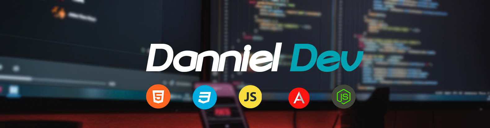
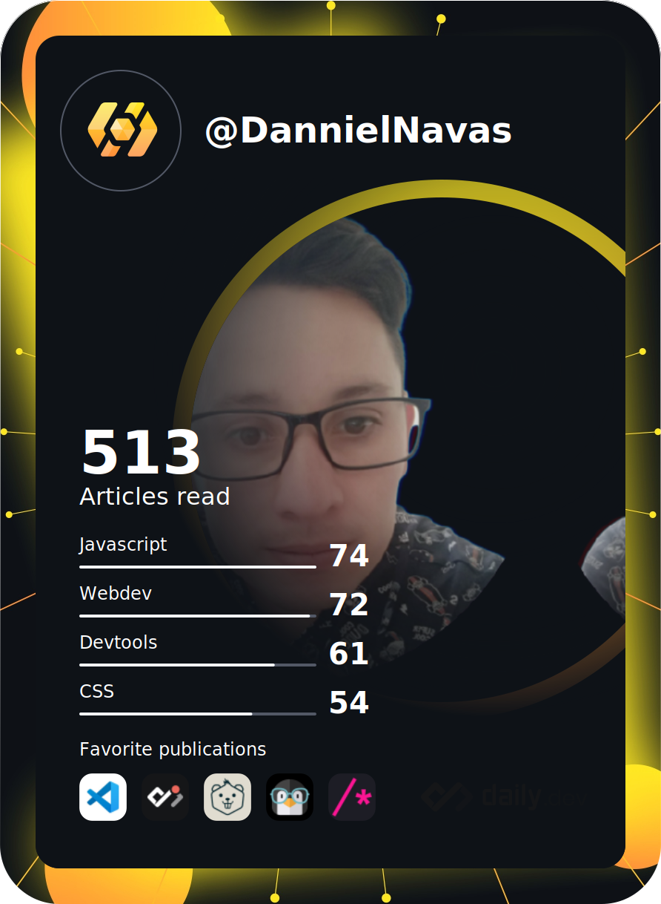

<div align="center">
  
</div>

<div align="center">
  <a href="https://www.instagram.com/_dannieldev/" target="_blank">
    
  </a>
  <a href="https://www.linkedin.com/in/luis-daniel-gordo-navas-28102386/" target="_blank">
    
  </a>
  <a href="https://www.youtube.com/channel/UC-WOFSnewqJ1CRjFuZYaYEQ" target="_blank">
    
  </a>
</div>

```javascript
(💻) => {
  return "Frontend developer.";
}
(🔭) => {
  return "Space fanatic.";
}
(💖) => {
  return "Husband and father.";
}
(📫) => {
  // "Questions ->" 
  window.location.href = "dannielnavas@gmail.com";
}
(⚡) => {
  return "Anime and science fiction fan."
}
(🎧) => {
  window.open('https://open.spotify.com/user/darker13-co');
}
(🖥) => {
  window.open('https://danniel.dev/');
}
```

<a href="https://app.daily.dev/DailyDevTips"></a>

<div align="center">
  [](https://github.com/DannielNavas/dannieldev)

  [](https://github.com/DannielNavas/dannieldev)

</div>

<div>Iconos diseñados por <a href="https://www.flaticon.es/autores/laisa-islam-ani" title="Laisa Islam Ani">Laisa Islam Ani</a> from <a href="https://www.flaticon.es/" title="Flaticon">www.flaticon.es</a></div>
